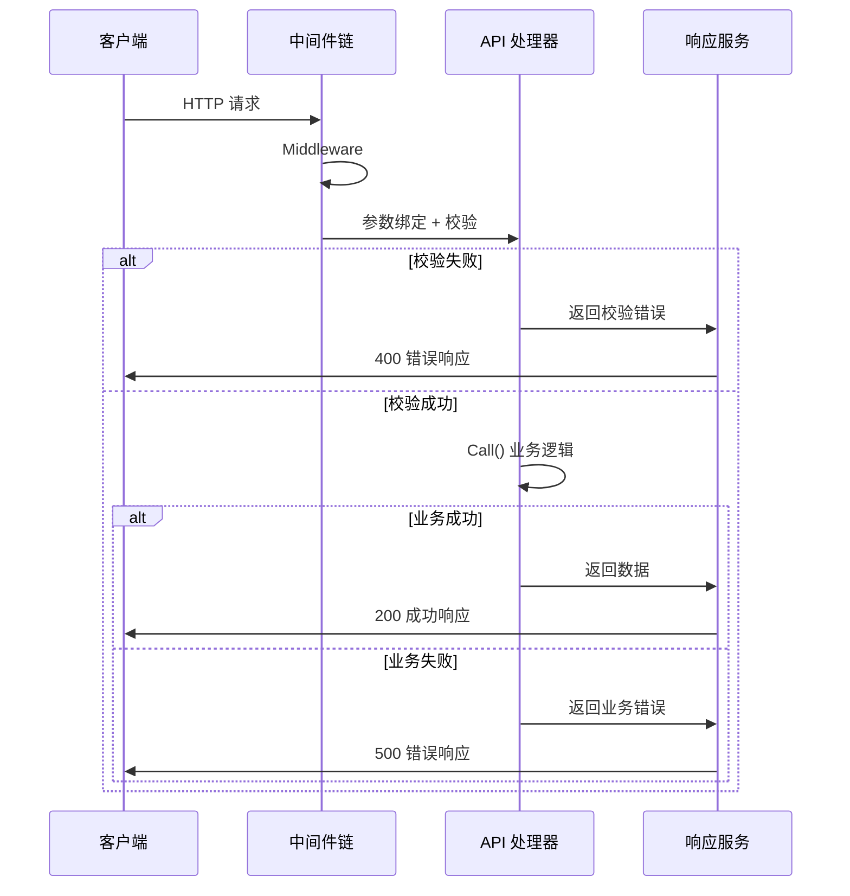

# 路由和中间件注册说明

## 概述

Hecc-Blot 框架基于 Gin 框架实现了路由和中间件的自动化注册机制，并提供参数自动校验和返回值自动包装功能。

**请求处理流程**:



***

## 路由注册机制

### 1. API 处理器接口

```go
type IApiHandle interface {
    Get(apiPath string, api interface{})
    Post(apiPath string, api interface{})
    Middleware(middlewares ...IMiddleware) IApiHandle
    Listen()
}
```

### 2. 创建 API 处理器

```go
// 创建响应服务
responseSvc := api.NewResponseSvc()

// 创建 API 处理器
apiHandle := api.NewApiSvc(&config.Server, responseSvc)
```

### 3. 注册路由

```go
func register(apiHandle iCoreApi.IApiHandle) {
    // 注册中间件
    apiHandle.Middleware(&ReplayMiddleware{}, &TokenMiddleware{})
    
    // 注册 POST 接口
    apiHandle.Post("account/add", &AddApi{})
    
    // 注册 GET 接口
    apiHandle.Get("account/list", &ListApi{})
}
```

***

## 中间件注册

### 1. 中间件接口

```go
type IMiddleware interface {
    Middleware() interface{}
}
```

### 2. 定义中间件

```go
// 示例1: 简单中间件
type ReplayMiddleware struct {
    // 可以通过 inject tag 注入依赖
    CacheFactory iCoreCache.ICacheFactory `inject:""`
}

func (r ReplayMiddleware) Middleware() interface{} {
    return func(c *gin.Context) {
        // 前置处理
        r.CacheFactory.Local().Set("key", "value", time.Minute)
        
        c.Next()
        
        // 后置处理
    }
}

// 示例2: Token 验证中间件
type TokenMiddleware struct {
    ResponseSvc iCoreApi.IResponse `inject:""`
}

func (t TokenMiddleware) Middleware() interface{} {
    return func(c *gin.Context) {
        // 从请求头获取 token
        token := c.GetHeader("Authorization")
        if token == "" {
            t.ResponseSvc.Regular(c, nil, errorSvc.NewError(response.TokenInvalid, errors.New("token 为空")))
            c.Abort()
            return
        }
        
        // 验证 token 逻辑...
        c.Set("user_id", 123)
        c.Next()
    }
}
```

### 3. 注册中间件

```go
apiHandle.Middleware(
    &ReplayMiddleware{},
    &TokenMiddleware{},
    &LoggerMiddleware{}
)
```

**执行顺序**: 按照注册顺序依次执行

***

## API 定义规范

### 1. API 接口

```go
type IApi interface {
    Call(ctx *gin.Context) (interface{}, coreError.IError)
}
```

### 2. 定义 API

```go
type AddApi struct {
    // 注入字段（必须放在最前面）
    DbFactory iCoreDb.IDbFactory `inject:""`
    LogSvc    iCoreLog.ILog      `inject:""`
    
    // 请求参数（必须放在最后，通过匿名嵌入）
    AddRequest
}

func (a AddApi) Call(ctx *gin.Context) (interface{}, iCoreError.IError) {
    // 使用注入的服务
    a.LogSvc.Info(ctx, "add account")
    
    // 使用请求参数
    newAccount := AccountModel{
        AccountName: a.Name,
    }
    
    // 数据库操作
    err := a.DbFactory.Build(ctx).Add(&newAccount)
    if err != nil {
        return nil, errorSvc.NewError(response.Fail, err)
    }
    
    // 返回数据
    return newAccount, nil
}
```

***

## 参数自动校验

### 1. 请求参数定义

```go
type AddRequest struct {
    Name     string `json:"name" binding:"required"`
    Age      int    `json:"age" binding:"required,min=1,max=150"`
    Email    string `json:"email" binding:"email"`
    Password string `json:"password" binding:"required,min=6"`
}
```

### 2. 自定义错误信息

实现 `IValidator` 接口来自定义错误信息：

```go
func (a AddRequest) GetMessages() entityApi.Messages {
    return entityApi.Messages{
        "Name.required":     "用户名不能为空",
        "Age.required":      "年龄不能为空",
        "Age.min":           "年龄最小为1",
        "Age.max":           "年龄最大为150",
        "Email.email":       "邮箱格式不正确",
        "Password.required": "密码不能为空",
        "Password.min":      "密码长度至少6位",
    }
}
```

### 3. 校验流程

框架在注册路由时自动进行参数校验：

```go
func (f *ApiHandle) registerAPI(apiPath string, apiInstance interface{}, method string) {
    // 注入依赖
    ioc.Inject(apiInstance)
    
    if v, ok := apiInstance.(api.IApi); ok {
        handler := func(c *gin.Context) {
            // 自动绑定参数并校验
            if err := c.ShouldBind(&v); err != nil {
                f.responseSvc.Regular(c, nil, coreError.Newf(response.ValidateError, GetErrorMsg(v, err)))
                return
            }
            
            // 调用 API
            resp, err := v.Call(c)
            f.responseSvc.Regular(c, resp, err)
        }
        
        // 注册路由
        switch method {
        case http.MethodGet:
            f.engine.GET(apiPath, handler)
        case http.MethodPost:
            f.engine.POST(apiPath, handler)
        }
    }
}
```

### 4. 校验器错误处理

框架提供了统一的错误信息获取方法：

```go
func GetErrorMsg(request interface{}, err error) string {
    if _, ok := errors.AsType[validator.ValidationErrors](err); ok {
        _, isValidator := request.(api.IValidator)
        
        for _, v := range err.(validator.ValidationErrors) {
            // 如果实现了 IValidator 接口，使用自定义错误信息
            if isValidator {
                if message, exist := request.(api.IValidator).GetMessages()[v.Field()+"."+v.Tag()]; exist {
                    return message
                }
            }
            return v.Error()
        }
    }
    return "Parameter error"
}
```

***

## 返回值自动包装

### 1. 响应格式

框架统一返回格式：

```json
{
    "code": 200,
    "message": "请求成功",
    "data": {}
}
```

### 2. 响应码映射

```go
var CodeMap = map[Value]string{
    Success:        "请求成功",
    Fail:           "操作失败",
    ValidateError:  "参数校验失败",
    TokenInvalid:   "Token无效",
    // ... 更多响应码
}
```

### 3. 响应服务实现

```go
type ResponseSvc struct {
    Code    response.Value `json:"code"`
    Message string         `json:"message"`
    Data    interface{}    `json:"data"`
}

func (r ResponseSvc) Regular(ctx context.Context, data interface{}, err coreError.IError) {
    g := ctx.(*gin.Context)
    code := response.Success
    
    if err != nil {
        code = err.GetCode()
        data = err.GetData()
    }
    
    r.Code = code
    r.Message = response.CodeMap[code]
    r.Data = data
    
    g.JSON(http.StatusOK, r)
}
```

### 4. 使用示例

```go
func (a AddApi) Call(ctx *gin.Context) (interface{}, iCoreError.IError) {
    // 成功返回
    return newAccount, nil
    // 返回: {"code":200, "message":"请求成功", "data":{"id":1, "name":"test"}}
    
    // 失败返回
    return nil, errorSvc.NewError(response.Fail, errors.New("添加失败"))
    // 返回: {"code":500, "message":"操作失败", "data":"添加失败"}
}
```

***

## 完整示例

### 1. 主函数入口

```go
func main() {
    // 加载配置
    config, _ := initConf("/config.yaml")
    
    // 创建组件
    logSvc, _ := log.NewLogger(&config.Log)
    dbFactory, clearUp, _ := db.NewDbFactory(&config.Db, logSvc)
    cacheFactory := cache.NewCacheFactory(&config.Cache)
    responseSvc := api.NewResponseSvc()
    
    // 注册到 IOC 容器
    ioc.Set(new(iCoreDb.IDbFactory), dbFactory)
    ioc.Set(new(iCoreLog.ILog), logSvc)
    ioc.Set(new(iCoreCache.ICacheFactory), cacheFactory)
    ioc.Set(new(iCoreApi.IResponse), responseSvc)
    
    // 创建 API 处理器
    apiHandle := api.NewApiSvc(&config.Server, responseSvc)
    
    // 注册路由和中间件
    register(apiHandle)
    
    // 启动服务
    apiHandle.Listen()
}
```

### 2. 路由注册

```go
func register(apiHandle iCoreApi.IApiHandle) {
    // 注册全局中间件
    apiHandle.Middleware(
        &ReplayMiddleware{},
        &TokenMiddleware{},
    )
    
    // 注册 API
    {
        apiHandle.Post("account/add", &AddApi{})
        apiHandle.Get("account/list", &ListApi{})
        apiHandle.Post("account/update", &UpdateApi{})
        apiHandle.Post("account/delete", &DeleteApi{})
    }
}
```

***

## 配置说明

### 服务配置

```yaml
server:
  port: "8080"
  env: dev  # dev | test | product
```

### 环境模式映射

| 环境      | Gin 模式      | 说明          |
| ------- | ----------- | ----------- |
| dev     | DebugMode   | 开发模式，输出详细日志 |
| test    | TestMode    | 测试模式        |
| product | ReleaseMode | 生产模式，优化性能   |

***

## 工作流程图

```
┌────────────────────────────────────────────────────────────────┐
│                      请求处理流程                              │
├────────────────────────────────────────────────────────────────┤
│                                                               │
│  请求 → [中间件1] → [中间件2] → [API处理] → [响应包装]        │
│                                                               │
│  详细流程:                                                     │
│  1. 请求到达                                                   │
│         ↓                                                     │
│  2. 中间件链执行 (ReplayMiddleware → TokenMiddleware)          │
│         ↓                                                     │
│  3. 参数自动绑定和校验 (ShouldBind)                            │
│         ↓                                                     │
│  4. 调用 API.Call()                                           │
│         ↓                                                     │
│  5. 返回值自动包装 (ResponseSvc.Regular)                       │
│         ↓                                                     │
│  6. 返回统一格式响应                                           │
│                                                               │
└────────────────────────────────────────────────────────────────┘
```

***

## 总结

框架的路由和中间件机制提供了以下特性：

1. **自动注入**: 注册时自动注入依赖服务
2. **参数校验**: 自动绑定并校验请求参数
3. **自定义错误**: 支持自定义校验错误信息
4. **统一响应**: 自动包装返回值为统一格式
5. **链式调用**: 支持中间件链式注册

核心优势：

- **减少样板代码**: 无需手动绑定参数和包装返回值
- **统一规范**: 所有 API 遵循统一的请求和响应格式
- **易于扩展**: 新增 API 只需定义结构体和实现 Call 方法
- **类型安全**: 编译时检查接口实现

